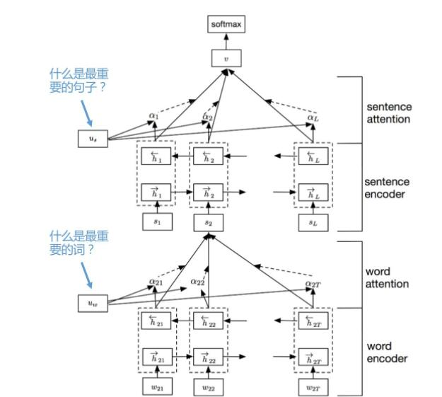

# GILE: A Generalized Input-Label Embedding for Text Classification

##### 论文来源：TACL 2019 
##### 论文链接：https://arxiv.org/abs/1806.06219
##### 代码链接：https://github.com/idiap/gile

---
## 启发：
现有的很多研究都是使用标签集合的k-hot向量进行训练。标签都只是被当成一个没有任何语义和标签空间结构的符号，而没有使用潜在的语义知识来描述输出的标签。
单词的语义描述已经被证实属于表示输入很有帮助，那么我们可以推断，对标签的语义描述应该也具有相同的效果。

## 做了什么：
- 作者鉴定了现有的联合输入标签模型的关键理论和实践限制。
- 作者在先前联合标签输入模型的基础上提出了一种新颖的带有灵活参数化的联合输入标签嵌入，并解决了现有模型的一些问题。
- 作者提供经验证据表明，作者的模型优于忽略标签语义的单语言和多语言模型，并且在可见标签和不可见标签上的标签都要优于之前的联合输入标签模型。
## 动机：
先前的工作通过联合输入标签空间利用了标签文本中的知识，起初用于图像分类中。 这样的模型在训练过程中同时概况可见和不可见的标签，并且在大量标签集上的扩展很好。 不过它还是具有下面三种限制：
- 因为它的双向线性关系，所以它们的嵌入无法捕获复杂的标签关系。 
- 因为输出层依赖于文本和标签的编码的维度所以输出层的参数比较死板。
- 在可见标签上使用交叉熵损失函数的分类器表现的更好。

## 文本分类的背景知识:
$D = \{(x_i,y_i),i=1,...,N\}$ 

$x_i$表示第i个文本，$x_i=\{w_{11},w_{12},...,w_{K_i,T_{K_i}}\}$ 

$K_i$表示是第i个文本中的句子数量,$T_{K_i}$表示该句子的单词数量。

$y_i=\{y_{ij}∈\{0,1\},j=1,...,k\}$ $k$表示标签的数量。

$c_i=\{c_{j1},c_{j2},...,c_{j,L_j}|j=1,...,k\}$ 表示标签$j$的描述。$L_j$表示描述的单词数量。

在训练过程中只给文本和他们的可见标签D。我们的目标是训练一个分类器在可见标签$Y_s$的样本集合和不可见标签$Y_u$的样本集合上都能预测。  $Y_s∩Y_u=Ø,Y_s∪Y_u=Y$

## 输入的文本表示：
作者使用多层注意力网络 (HANs,hierarchical attention networks)来给输入文本编码。HANs在单语言和多语言分类上都有不错的竞争力。

输入：文本$x$   -->  输出：文本向量$h$，并形成词嵌入矩阵$E$

$E∈IR^{|V|×d}$  。$V$是词汇表， $d$是词嵌入的维度。

## 编码：
$g_w$对句子$i$,$\{w_{it}|t=1,2...,T_i\}$ 进行编码。
$h_{w}^{(it)}=g_w(w_{it}),t∈[1,T_i]$

将单词矩阵$\{h_{w}^{(it)}|t=1,...,T_i\}$联合(combining)成一个句子向量$s_i∈IR^{d_w}$,$d_w$是单词编码的维度。

$g_s$对句子序列$h_s^{(i)}=\{s_i|i=1,...,K\}$进行编码。

$g_w,g_s$可以是任何前向反馈网络，比如RNN或者GRU。

## 注意力：

## HANs网络结构：
